```{r setup, include=FALSE}
knitr::opts_chunk$set(echo = TRUE)
```

```{r, echo=FALSE, out.width="100%"}

```

> **TEMAS CENTRALES DEL MÓDULO**

> -   Instalación y primeros pasos con el entorno de trabajo
>     **R**/RStudio.

> -   Estructura general de R -- términos específicos. Donde encontrar
>     ayuda.

> -   Lectura de datos, comprobación de nuestros datos.

> -   Estadísticas descriptivas - Exploración de bases de datos.

------------------------------------------------------------------------

# Instalación y primeros pasos con el entorno de trabajo R/RStudio

Empezaremos describiendo el software estadístico **R** y su interfaz
**RStudio**.

## ¿Qué son **R** y **RStudio**?

**R** es un entorno y lenguaje de programación que nos permitirá
realizar análisis y gráficos estadísticos. **R** es muy flexible. **R**
tiene una interfaz de línea de comandos o CLI (del inglés *command-line
interface*). Los procedimientos estadísticos estándar se pueden aplicar
y combinar de manera eficiente utilizando el comando apropiado. Además,
para llevar a cabo procedimientos más específicos, existen multitud de
librerías programadas por usuarios de todo el mundo. En última
instancia, es posible programar nuestros propios procedimientos y
aplicaciones.

Podríamos bajar **R**, instalarlo y usarlo directamente, pero se han
desarrollado editores externos que lo hacen mucho más amigable, el más
utilizado (aunque no es el único) es **RStudio**. (www.rstudio.com).
Este editor es un entorno de desarrollo integrado o IDE (del inglés
*integrated development environment*) especialmente orientado a **R**.

Ambos programas son *libres y de código abierto* ya que su distribución
es libre o gratuita y se puede acceder al código fuente para estudiarlo,
modificarlo y mejorarlo. Así mismo podemos ejecutar el programa con
cualquier propósito.

**R** y **RStudio** se instalan por separado. **R** puede funcionar sin
**RStudio**, en cambio éste necesita que al menos una versión de **R**,
por ende este debe instalarse primero. A continuación se describe el
procedimiento para instalar **R** y **RStudio** bajo Windows.

## ¿Cómo obtener **R**?

Podemos descargar **R** desde la siguiente dirección web
(<https://www.r-project.org/>), entrando a la pagina de R, o de forma
directa desde este enlace <https://cran.r-project.org/bin/windows/base/>

```{r fig1, echo = F, fig.cap = "Página web del Proyecto **R**"}
if (!file.exists('./Figuras_tema_1/rproject_webpage.png')) {
  webshot::webshot("https://www.r-project.org/", 
                   "./Figuras_tema_1/rproject_webpage.png",
                   cliprect = c(0, 0, 1000, 1000))
} else {
  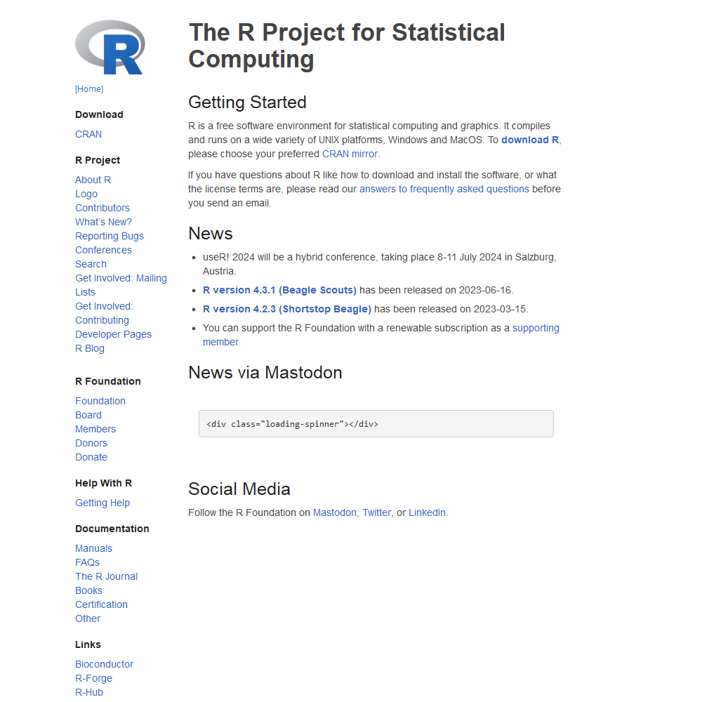
}
```

El **CRAN**, del inglés *Comprehensive R Archive Network*, es el
repositorio donde se encuentran archivadas todas las distribuciones
**R**, incluyendo sus paquetes (*packages*), para la distintas versiones
de los sistemas operativos (Windows, Mac OS, Linux). Las actualizaciones
son frecuentes (cada 3 meses aproximadamente).

El link **CRAN** debajo de **Downloads** nos lleva a seleccionar uno de
los servidores espejo (*mirrors*) donde se aloja el proyecto. Hay
servidores en varios países de todos los continentes. Es conveniente
seleccionar un espejo que se encuentre geográficamente cerca nuestro.
Una vez elegido el mirror, se debe seleccionar la versión según nuestro
sistema operativo (Linux, Mac, Windows).

```{r echo=FALSE, fig.align='center', out.height="100%", out.width="100%", fig.cap="Captura de pantalla de la página web donde se seleccionan los espejos"}
if (!file.exists('./Figuras_tema_1/rproject_mirrors.png')) {
    webshot::webshot("https://cran.r-project.org/mirrors.html",
                     "./Figuras_tema_1/rproject_mirrors.png", 
                     cliprect = c(0, 0, 1000, 1000))
} else {
  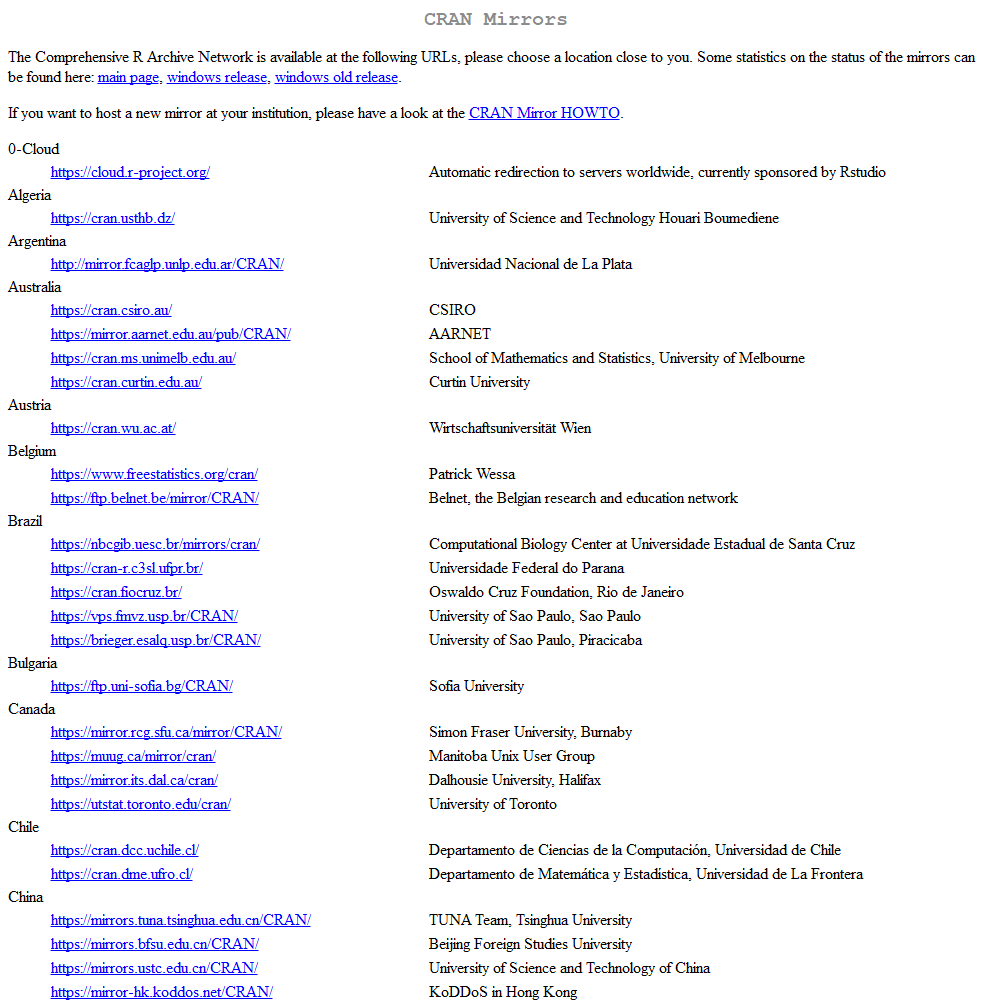
}
# 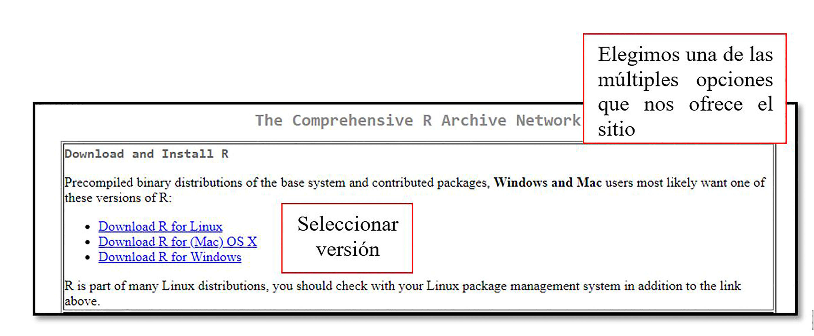
```

```{r echo=FALSE, fig.align='center', out.height="100%", out.width="100%", fig.cap="Captura de pantalla de la página web donde se seleccionan el sistema operativo"}
if (!file.exists('./Figuras_tema_1/rproject_os.png')) {
    webshot::webshot("https://cloud.r-project.org/",
                     "./Figuras_tema_1/rproject_os.png", 
                     cliprect = c(0, 0, 1000, 1000))
} else {
  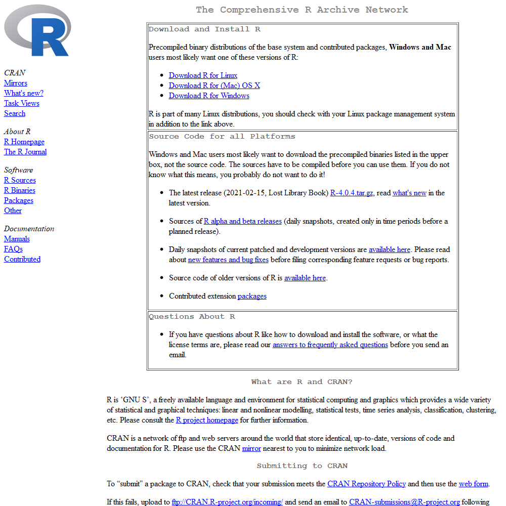
}
# 
```

En el caso de Windows, la distribución de **R** y sus paquetes se
realiza mediante archivos *binarios* (ya compilados). En cambio para Mac
y Linux, se distribuyen los *archivos fuente* y se compilan localmente
(en cada máquina), debido a la diversidad de distribuciones y
configuraciones.

Haciendo click en **Windows** la ventana siguiente aparecen varios
subdirectorios los cuales contienen:

-   **base** el archivo del programa (ejecutable)
-   **contrib** los archivos binarios de los paquetes compatibles con
    las distintas versiones de **R**.
-   **old contrib**: similar a **contrib** pero para paquetes
    desactualizados o de versiones anteriores a 2.12
-   **Rtools**: herramientas necesarias para compilar **R** y sus
    paquetes desde código fuente.

Si se instala por primera vez es conveniente usar el link [install **R**
for the fisrt time](https://cloud.r-project.org/bin/windows/base/) que
contiene instrucciones específicas para la primera instalación

```{r echo=FALSE, fig.align='center', out.height="100%", out.width="100%"}
  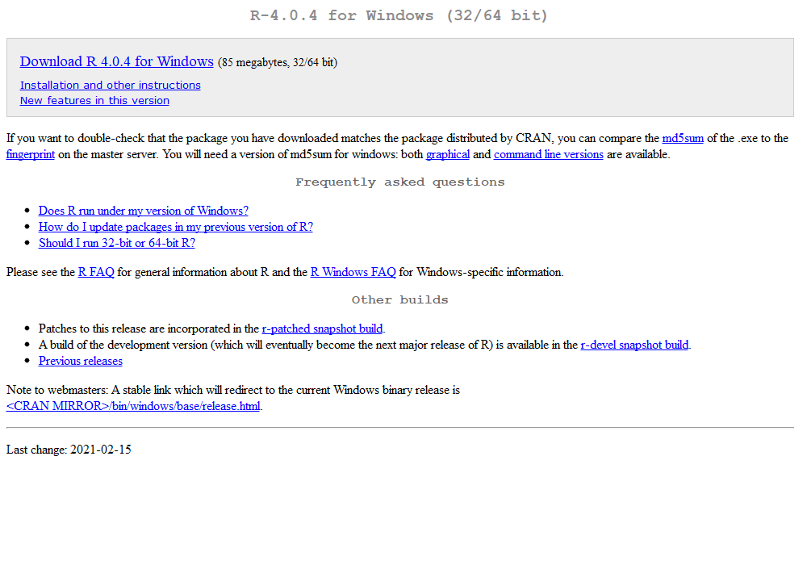

```

Alternativamente se puede descargar la última versión de **R** para
Windows directamente desde este
[link](https://cloud.r-project.org/bin/windows/base/release.htm) el cual
redirige automáticamente a un espejo (mirrow) cercano.

La instalación básica de **R** o *core* contiene una serie de paquetes
(*base, graphics, stats, utils*) módulos con funciones y procedimientos
para realizar el manejo de datos, análisis estadísticos y gráficos. Para
adicionar paquetes y extender las funcionalidades es necesario
instalarlos luego desde **Rstudio**.

## ¿Cómo obtener **RStudio**?

1)  Ir al sitio web de descarga de **RStudio**
    (<https://posit.co/download/rstudio-desktop/>)

```{r, echo = F, out.width = "75%", fig.align = 'center'}

  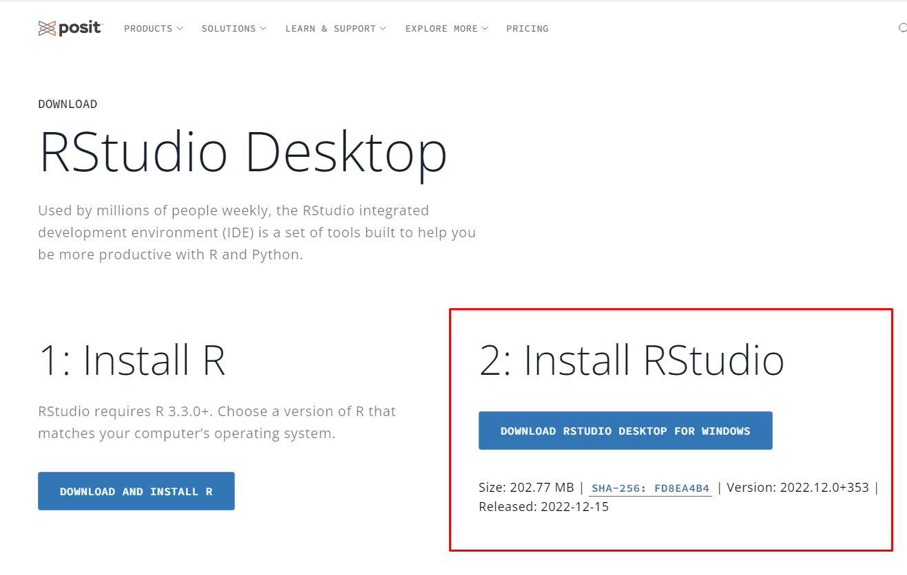

```

2)  Descargar el archivo de instalación correspondiente a nuestra
    plataforma o sistema operativo, en este caso Windows.

```{r echo=FALSE, fig.align='center', out.height="100%", out.width="100%"}
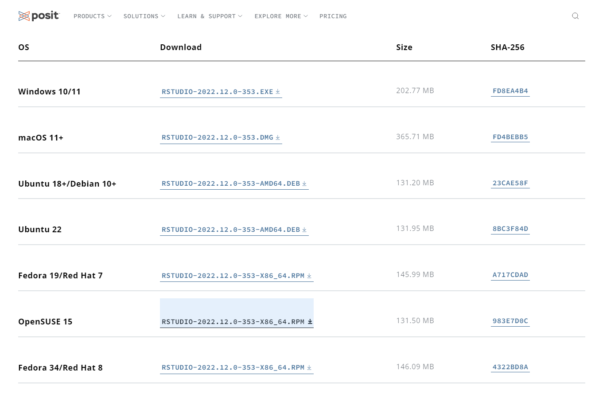
```

3)  Ejecutar el archivo `.exe` [^1] y seguir el asistente de instalación
    con todas las opciones por defecto.

[^1]: Al momento de escribir estas instrucciones la última versión
    estable de **RStudio** era `RSTUDIO-2022.12.0-353.EXE`.

<!-- -->

4)  Si la instalación ha sido exitosa en el menú *Inicio* dentro de la
    carpeta *RStudio* se encontrará el acceso directo a **RStudio** el
    cual, mediante el menú contextual (botón derecho del ratón) puede
    enviarse al Escritorio como acceso directo o bien anclar al menú de
    Inicio o barra de acceso rápido.

Ahora sí, ya tenemos listo **R** y **RStudio** para empezar a trabajar!!

**Aclaración**: a partir de la versión 1.2, **RStudio** dejó de ofrecer
versiones compatibles con sistemas operativos 32-bits. Para descargar la
última versión compatible con ese tipo de arquitectura (v 1.1.463) hay
que descargar el archivo `.exe` desde el siguiente
[link](http://download1.rstudio.org/RStudio-1.1.463.exe)

## Estructura general de **R** -- terminos específicos. Donde encontrar ayuda.

## ¿Qué alternativas tengo si no puedo descargar los software a mi PC?

Existe la posibilidad de utilizar R y Rstudio online de forma gratis,
con algunas limitaciones, pero lo que ofrece de esta forma es más que
suficiente para este taller y usos particulares. Para esto deben entrar
en este enlace: <https://posit.cloud/> y armarse un usuario:

```{r echo=FALSE, fig.align='center', out.height="100%", out.width="100%"}
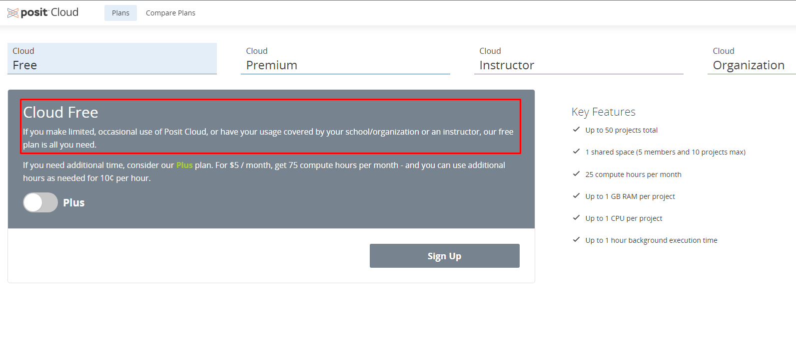

```

Obtención de ayuda en **R**

En **R** se puede obtener ayuda de varias maneras: Si estamos en Rstudio

-   Tecleando `help(nombre_del_comando)` se abre una ventana con
    información sobre un comando específico. Pruebe por ejemplo, tipear
    el siguiente comando:

```{r, eval = F, message=TRUE, warning=FALSE}
help(mean)
```

-   Otro comando muy útil es `help.search('palabra clave')`, donde
    reemplazamos `'palabra clave'` por algo que nos ayude a buscar. En
    este caso obtenemos una lista de los comandos relacionados con
    palabra clave. Por ejemplo, teclea `help.search('median')` y
    obtendrás una lista de comandos de **R** relacionados con la medida
    estadística mediana.

-   Finalmente, una forma de obtener ayuda en formato HTML consiste en
    teclear `help.start()`.

-   Para conocer cómo funciona cualquier función de **R**, tipee en la
    consola principal el signo `?` seguido del nombre de la función o
    comando. Por ejemplo: `?plot` nos mostrará cómo funciona la función
    `plot()`. También podemos posicionarnos sobre la función de interés
    al presionar la tecla `F1`.

A estas funciones se puede acceder directamente desde **RStudio** en la
ventana inferior derecha

```{r echo=FALSE, fig.align='center', out.height="100%", out.width="100%", fig.cap = "Ventanas de **RStudio** donde se muestra la ventana inferior derecha donde está la ayuda para las distintas funciones de los paquetes de **R**"}
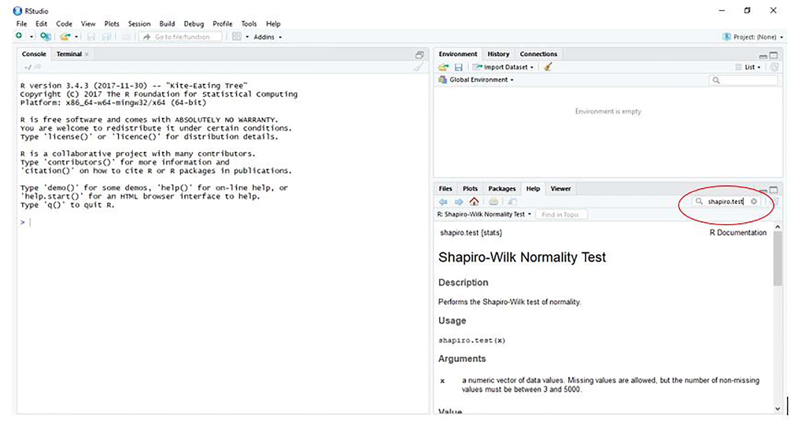
```

-   Existen muchos foros o plataformas online donde consultar dudas
    puntuales, o buscar quienes consultaron antes sobre el tema tales
    como [Github](https://github.com/) y
    [Stackoverflow](https://stackoverflow.com/). Para aquellos que
    quieran estar al día con las novedades de **R** pueden subscribirse
    al blog: [R-Bloggers](https://www.r-bloggers.com/) y recibir si
    desean por correo electrónico las ultimas noticias al respecto.

-   Por último simplemente se puede copiar el error que aparece
    directamente en un buscador como Google y seguramente aparecerá en
    la búsqueda algún sitio donde se consultó ya esta duda o error.

### Proyectos en **RStudio**

**R** trabaja con un directorio de trabajo o *working directory* que es
la dirección o *path* que figura en el título del panel **Console**. Por
defecto es el directorio base del usuario que depende de cada
plataforma. En linux es el `/home/usuario` en cambio en Windows es
`C:/Users/usuario/Documents`. A menos que se especifique lo contrario,
se asume que los archivos de entrada o salida se ubican en dicha
carpeta. Esto se puede modificar en cualquier momento con la función
`setwd()`.

**RStudio** extiende esta característica a través de los proyectos o
*projects*. Cada proyecto es una carpeta o *folder* que contienen un
archivo `.RProj` con algunas configuraciones específicas. Al abrirlo en
RStudio, automáticamente se cambia el directorio de trabajo a esta
carpeta. Esto permite organizar los archivos de datos, las salidas, los
scripts, etc., dentro de un directorio de trabajo (*working directory*)
y volver a ellos de manera más rápida, eficiente, y portable.

#### ¿Cómo crear un proyecto?

Para crear un proyecto:

1.  Ir a `File > New project...` o bien el ícono `Create project` de la
    barra de herramientas.

```{r, echo = F, out.width = "65%", fig.align = 'center', fig.pos= 'h', out.extra=''}
knitr::include_graphics("Figuras_tema_1/new_project.png", auto_pdf = T)
```

2.  Seleccionar `New Directory` y en `Project type` seleccionar
    `New project`.

```{r, echo = F, out.width = "65%", fig.align = 'center', fig.pos= 'h', out.extra=''}
knitr::include_graphics(c("Figuras_tema_1/new_project1.png", "Figuras_tema_1/new_project2.png"), auto_pdf = T)
```

3.  Una vez en el cuadro de diálogo `Create new project` ingresar el
    nombre del proyecto (e.g. `DOE`) en `Directory name` que será a su
    vez el nombre de la carpeta que RStudio va a crear por nosotros.
    Luego en `Create project as a subdirectory of` indicar *donde*
    queremos que Rstudio cree la carpeta.

```{r, echo = F, out.width = "65%", fig.align = 'center', fig.pos= 'h', out.extra=''}
knitr::include_graphics("Figuras_tema_1/new_project3.png", auto_pdf = T)
```

4.  Si todo sale bien, se crea la carpeta con el nombre que indicamos y
    dentro de ésta un archivo con extensión `.Rproj`

### Paquetes (Packages)

Muchas funciones en **R** vienen en paquetes opcionales creados por la
comunidad de usuarios de **R**. La instalación de paquetes se realiza
con el comando `install.packages(“nombre_paquete”)` o desde la opción
packages de **RStudio**. Más adelante veremos cuales son los paquetes
específicos que usaremos en el presente curso.

```{r echo=FALSE, fig.align='center', out.height="100%", out.width="100%", fig.cap = "Pantalla de **RStudio** donde se listan los paquetes instalados*"}
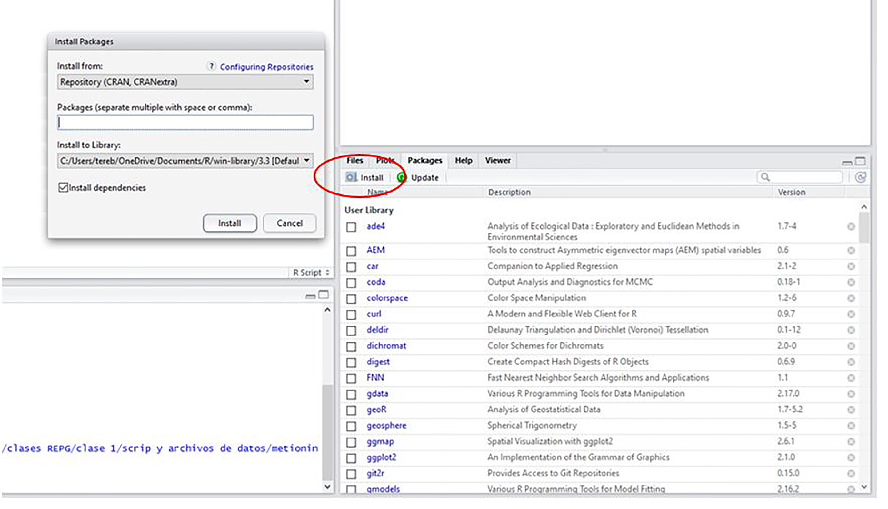
```

Este comando descarga y crea una carpeta dentro del directorio `/R`
ubicado por defecto dentro del directorio de cada usuario. Esto se
realiza una única vez mientras no cambiemos a una versión de R o
Rstudio. Luego, en cada sesión de trabajo se puede acceder a las
funciones contenidas en el paquete cargándolo por completo en el entorno
de trabajo mediante la función `library(nombre_paquete)` o bien llamando
a alguna función particular nombrando la función precedido de el nombre
del paquete y `::`. Por ejemplo: `nombre_paquete::nombre_funcion()`.
Observar que los nombres de los paquetes se escriben entre comillas,
mientras la librerías no.

**Comentarios:**

1.  Algunos paquetes cuando son cargados con el comando `library()`
    producen algún mensaje o cargan otros paquetes intermedios. A menos
    que el mensaje diga `Error` los mensajes son solo informativos.

2.  El orden de los paquetes altera el producto. Si el paquete `A` y el
    paquete `B` proveen una función llamada `fun()`, la función que se
    utiliza al llamar `fun()` será la que corresponde al paquete que se
    cargó en última instancia. Para evitar esto podemos indicar de que
    paquete queremos ejecutar la función `fun()` ejecutando `A::fun()` o
    `B::fun()` para ejecutar la versión que se encuentra en `A` o `B`
    respectivamente.

------------------------------------------------------------------------

# Lectura de datos

Vamos a focalizarnos en las diversas formas de entrar datos a R.

## Datasets de base

R contiene `datasets` que pueden ser utilizados directamente. Para dar
un vistazo a los conjuntos de datos

```{r , message=TRUE, warning=FALSE}
conjuntos <- library(help = "datasets")
head(conjuntos$info[[2]])
```

Para ver la lista completa con toda la información, entrar paquetes en
la consola nos abrirá una ventana. Utilizar datos que vienen con la
instalación R nos facilitará avanzar hacia modelado y comunicación. Por
ejemplo, en muchas ocasiones utilizaremos el dataset iris, que contiene
información sobre la longitud de pétalos y sépalos en tres plantas
distintas. A continuación se darán detalles más específicos para
importar datos a R.

## Importar datos de manera manual

Antes de importar los datos en **R**, es importante que tengamos los
mismos con un formato determinado. Por lo general ingresaremos nuestros
datos en planillas Excel. Lo importante es que tengamos una planilla
exclusivamente para guardar la información donde *cada columna
corresponde a una variable y cada fila corresponde a un registro, i.e.
evitar encabezados multi-líneas, etc.*.

Muchas veces tratamos de hacer gráficos o incluir fórmulas de resúmenes
o de promedios en la misma hoja Excel, pero todo eso debería hacerse en
hoja aparte. También debemos conocer el directorio de trabajo en donde
estamos trabajando y el directorio de trabajo en donde se encuentran
nuestros datos. Esto es muy importante a tener en cuenta, dado que
muchas veces **R** trabaja en una carpeta por defecto y nuestros datos
suelen encontrarse en otras carpetas.

**Importante**: La utilización de caracteres especiales, incluidos "ñ",
acentos y espacios en los nombres de los archivos y las variables puede
convertirse en un dolor de cabeza ya que, dependiendo del sistema
operativo o de la configuración regional, puede que **R** no los
reconozca y los codifique de forma errónea. Si bien esto se puede
solucionar utilizando formato de codificación de caracteres Unicode e
`ISO-10646` conocido como `UTF-8` al guardar los comandos, no siempre
funciona. La recomendación sería evitar en lo posible el uso de este
tipo de caracteres.

*Abrir **RStudio***

En los párrafos anteriores vimos cómo descargar el programa e instalar
**R** y **RStudio**. Ahora simplemente tenemos que abrir **RStudio** el
cual iniciará una sesión de **R** dentro de una de sus ventanas.

```{r echo=FALSE, fig.align='center', out.height="100%", out.width="100%", fig.cap = "Pantalla inicial de Rstudio"}
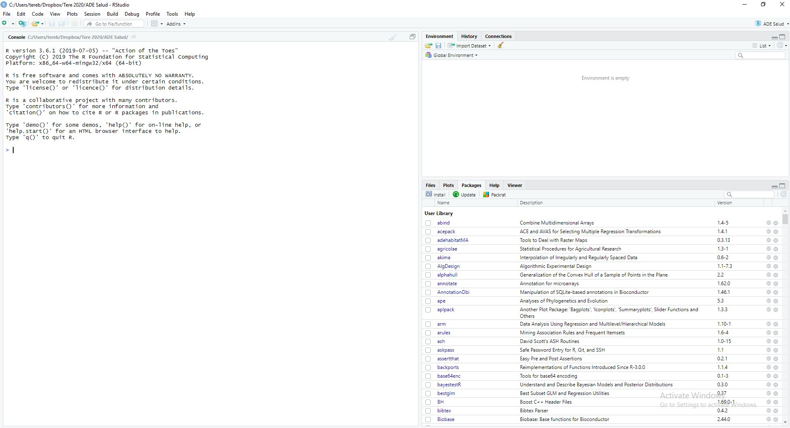
```

Recuerde que para poder acceder a los datos tenemos que armar una
carpeta dónde vayamos a ubicar nuestra base de datos en Excel y nuestros
*scripts* con los comandos. Lo recomendable es que esa carpeta sea un
proyecto de **RStudio** como vimos antes. Veamos entonces cómo acceder a
los datos que tenemos guardado en la carpeta del proyecto a través del
menú que nos va guiando paso a paso.

```{r echo=FALSE, fig.align='center', out.height="100%", out.width="100%", fig.cap = "Menú de lectura de datos externos"}
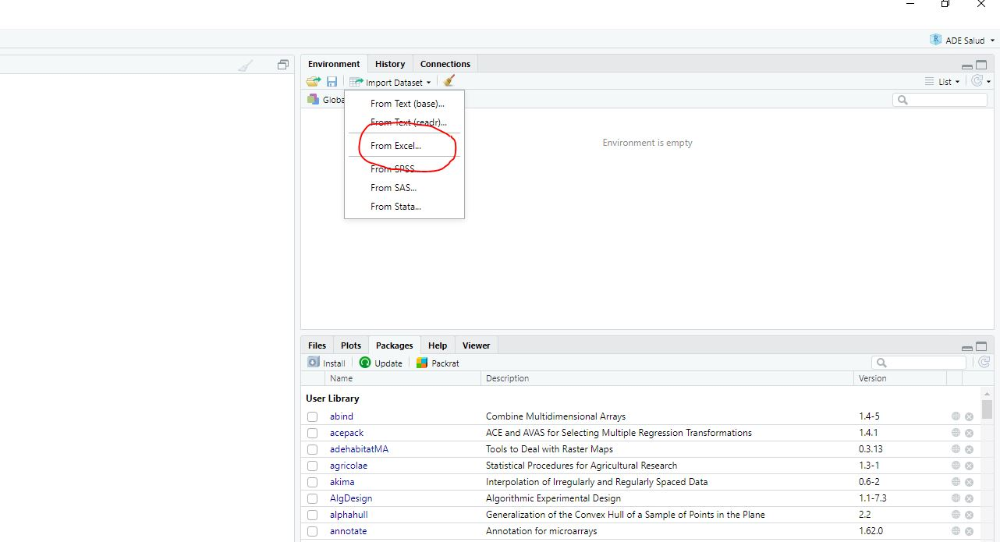
```

Una vez que abrimos el menú correspondiente al tipo de datos que
queremos importar se despliega una nueva ventana donde se habilita un
explorador. Este apunta por defecto a la carpeta de trabajo que es la
del proyecto. También se pueden buscar archivos en otras ubicaciones de
nuestra computadora. Una vez seleccionado el archivo, simplemente le
damos aceptar y aparecerá una visualización previa de los datos. Antes
de aceptar es bueno revisar que el visualizador arriba de cada columna
nos dice, qué tipo de datos son, pueden ser numéricos o caracteres
tenemos que verificar que esto coincida con el tipo de variable que
estamos importando. Por otro lado en el panel `Code Preview` se muestran
los comandos que se utilizan para importar los datos los cuales se
pueden copiar en portapapeles.

```{r echo=FALSE, fig.align='center', out.height="100%", out.width="100%", fig.cap = "Importación de datos hoja excel"}
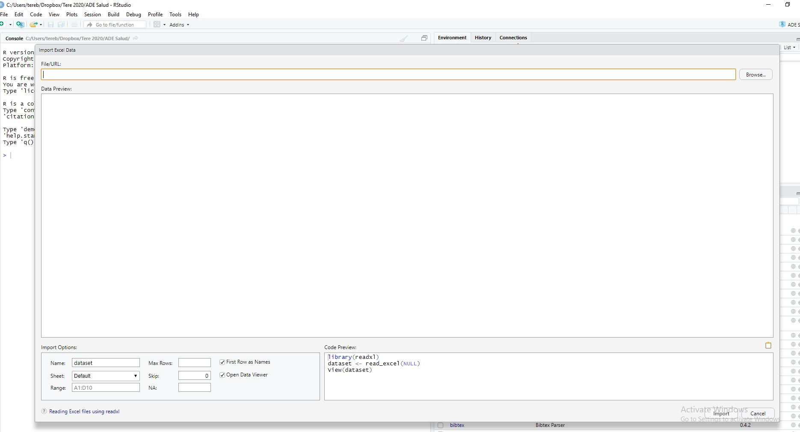
```

El próximo paso vamos hacer empezar a escribir los comandos para
analizar los datos que importamos, para esto vamos a armar un nuevo
archivo como lo indica la siguiente figura. Este archivo lo podemos
guardar dándole nombre apropiado utilizando el comando `Save As..`
(Guardar como) y lo conveniente es que el archivo esté junto a los datos
en la misma carpeta del proyecto.

```{r echo=FALSE, fig.align='center', out.height="100%", out.width="100%", fig.cap = "Abriendo ventana donde hacer los análisis"}
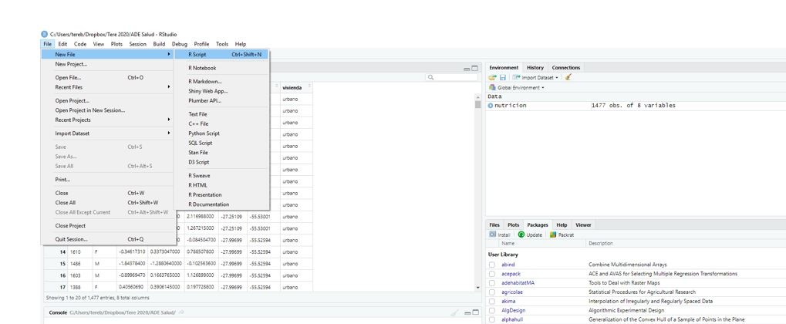
```

*¿Cómo hace R para leer datos externos?*

Nos introduciremos al uso de R haciendo un análisis descriptivo de la
información. La base de datos que utilizaremos fue obtenida del sitio:
<https://datos.gob.ar/dataset/ambiente-incendios-forestales> La
información en la base de datos corresponde a la cantidad de incendios
en las distintas provincias argentinas diferenciadas por fecha y origen.
El objetivo será abrir la base de datos en R y realizar algunas
estadísticas descriptivas. Veamos como empezar a usar R para poder
analizar la información de este sitio.

```{r, fig, echo = F, fig.cap = "Página datos oficiales"}
if (!file.exists('./Figuras_tema_1/incendios.png')) {
  webshot::webshot("https://datos.gob.ar/dataset/ambiente-incendios-forestales/", 
                   "./Figuras_tema_1/incendios.png",
                   cliprect = c(0, 0, 1000, 1000))
} else {
  
}
```

Como vimos en el ejemplo los datos se pueden importar directamente
utilizando un asistente de **RStudio**, es importante conocer cuáles son
las funciones que utiliza y cuáles son sus argumentos e incorporar esas
líneas en nuestro script para que sea reproducible. En **R** hay muchas
maneras de importar datos desde distintas fuentes (Excel, bases de
datos, SPSS, etc.) pero la más habitual consiste en leer ficheros de
texto con la función `read.table()` y sus derivados.

A través del menú podemos importar nuestros datos. Este menú no hace más
que escribir por nosotros la función que importa los datos. Estos
comandos son los que aparecen en el panel `Code Preview` y que hemos
copiado en portapapeles. Es útil para próximas sesiones copiar y pegar
estos comandos en el script para usarlos cada vez que queramos sin tener
que volver a hacer el procedimiento anterior. Finalmente los comandos
que quedarían para leer nuestros datos son los siguientes:

```{r echo=TRUE, message=TRUE, warning=FALSE}
# Lectura de base de datos
library(readxl)
datos <- read_excel("incendios.xlsx") 
```

Veamos los comandos presentados. La primera línea comienza con `#` o
hashtag que indica que lo que viene a continuación en la línea es un
*comentario* y por lo tanto no tiene que ser evaluado o ejecutado. En
este caso dice *Lectura de base de datos*. Cualquier cosa que escribamos
precedida por este símbolo no ejecutará ningún comando ya que es
simplemente un comentario que nos puede servir para entender qué es lo
que estamos haciendo. También es muy útil para desactivar o ignorar
partes del código.

La función `read_excel()` lee los datos, por defecto tomando la hoja 1,
y devuelve un `data.frame` (que es la forma que tiene **R** para
representar algunos conjuntos). Esta función es suministrada por el
paquete `readxl` por lo tanto es necesario cargar dicho paquete con
`library(readxl)` al inicio de la sesión.

Si quisiéramos indicar otras hojas o rangos usando el argumento `sheet`
y `range` respectivamente. Por ejemplo si quisiéramos tomar la hoja 2 y
las celdas comprendidas entre `A2` y `C8` de la planilla tendríamos que
indicar los argumentos `sheet = 2` y `range = "A2:C8"` separados por
comas)

Para poder disponer de los datos en memoria es necesario *asignar* ese
`data.frame` a un objeto. Esto lo hacemos con el simbolo de asignación
`<-`. En este caso nuestro objeto se llamará `datos`. Este nombre es
independiente del nombre que tiene la base en Excel.

La función `View()` abre una pestaña que nos muestra el set de datos
recién importado en el objeto `datos` de una manera similar a una
planilla de cálculo.

```{r, message=TRUE, warning=FALSE}
# Nombres de variables
names(datos)
```

Podemos obtener una exploración rápida de los datos usando la función
`summary()`.

```{r, message=TRUE, warning=FALSE}
summary(datos)
```

Antes de analizar cualquier base de datos es importante utilizar este
tipo de comandos y verificar que los registros que estamos leyendo son
los que queremos, y si se están leyendo de forma correcta. Por lo
general las bases de datos espaciales contienen muchos valores es por lo
tanto fácil cometer errores.

Con este procedimiento se puede ver por ejemplo si hay datos faltantes o
cuando los valores son numéricos, verificar que los valores de promedios
mínimos y máximos son coherentes con la variable con la que estamos
trabajando. Esto es importante porque someter a análisis variables con
datos erróneos puede conducir a conclusiones equivocadas.

## Archivos de texto

La gran ventaja de mantener archivos de texto (por ejemplo, .csv o .txt)
es que una enorme cantidad de software es capaz de leerlos y no están
ligados a un sistema operativo. Estos archivos son normalmente livianos
y es fácil mantenerlos como sólo lectura, es decir, archivos en los que
no cambiamos la información, sólo accedemos a ella. Si nuestros datos
están guardados en un archivo de texto de sólo lectura, es menos
probable que ocurra corrupción de datos o que, con el paso del tiempo,
los mismos no puedan abrirse porque el software se ha discontinuado.

R tiene funciones genéricas para abrir este tipo de archivos en una
tabla como `read.table(...)`. Esta función presume pocas cosas en la
estructura de datos, por lo que permite especificar un montón de
parámetros y nos brinda variabilidad (ver `help(read.table))`. Sin
embargo, en general conocemos la estructura de nuestros datos (por
ejemplo, la primera fila es el título de las columnas o es un archivo
separado por comas). Por lo tanto, usaremos llamadas del estilo:

`datos <- read.csv(file = 'nombre_de_archivo.csv')` Es común que las
computadoras en español utilicen el separador ; en vez de , para
archivos .csv. En ese caso, podemos especificar:

`datos <- read.csv(file = 'nombre_de_archivo.csv', sep = ';')` Un
archivo separado por tabulaciones (.txt) puede leerse como:

`datos <- read.table(file = 'nombre_de_archivo.txt', sep = '\t')`

## Importar múltiples archivos de texto

Normalmente tendremos múltiples archivos de texto, probablemente
llamados de manera seriada en una carpeta dentro de nuestro working
directory (por ejemplo, tendremos resultados/sujeto001.csv,
resultados/sujeto002.csv, ... resultados/sujeto154.csv).

-   Obtener lista de archivos dentro de la carpeta 'resultados'

`lista_nombres <- list.files(path = 'resultados')`

-   leer todos los archivos en una nueva lista

`lista_archivos <- lapply(lista_nombres, read.csv())`

Esta estrategia nos ahorra tener que escribir 154 llamadas a
`read.csv()` con el nombre de archivo correcto. También facilita el
acceso a todas las tablas en un único objeto, la lista lista_archivos.

## Otros formatos

### Desde la web

Es posible utilizar una URL para leer datos. Es necesario conocer la
dirección directa al archivo de texto y su extensión.

`datos <- read.table("http://www.algunapagina.com/datos/nombre-archivo.txt")`

### SAS

Si jugaron con los cuadros de diálogo para importar datos de forma
manual, probablemente se toparon con el paquete haven, por ejemplo
podemos leer desde SAS usando:

`library(haven)` `dataset <- read_sas(...)` También es posible usar
`foreign` y la función `read.ssd()`.

### SPSS

R puede leer datos directamente de spss:

El paquete `foreign` contiene la función `read.spss()`. El paquete
`haven` y la función `read_spss()`.

# Estadísticas descriptivas en R

Después de leer los datos y verificar en el resumen que se importaron
bien estimaremos algunos estadísticos.

## Estimación de parámetros

```{r, message=TRUE, warning=FALSE}
library(fBasics)
estadisticas_datos <- basicStats(datos[, c(4:7)])
round(estadisticas_datos, 2)

```

Miremos los resultados de nuestra tabla. Lo primero que muestra para
cada variable es el número de observaciones `nobs`. En este caso todas
las observaciones son completas ya que tienen la misma cantidad
registros. Donde dice `NAs` se refiere a los datos ausentes. En algunas
situaciones suele ser común que algún registro que no se pudo tomar o se
perdió. Es importante tenerlo en cuenta porque como vamos a ver después
algunos de los cálculos se complican cuando tenemos datos ausentes.

El siguiente estimador que aparece es el mínimo junto con el máximo, lo
que hay que verificar es que estos valores tengan sentido dentro de la
escala de valores.

Después de están el primer y tercer cuartil que marcan los valores por
debajo del cual está el 25% y el 75% de los valores respectivamente.
También tenemos los valores de promedio y de mediana que en las
distribuciones simétricas por lo general la media y la mediana suelen
coincidir. `SE Mean` hace referencia al error estándar de la media.

Aparecen publicados los límites inferior (`LCL`) y superior (`UCL`) de
los intervalos de confianza. Podemos decir que tenemos un 95% de
confianza de que ese intervalo crucé el verdadero valor del parámetro.
Recuerden que el parámetro es un valor fijo y variables son los datos
que tomamos mediante un muestreo aleatorio y los estadísticos que
calculamos a partir de ellos.

Por último hay además una serie de medidas de dispersión, y otras
medidas que nos están indicando si existe o no existe simetría, les dejo
como ejercicio buscar cómo se interpretan.

## Obtención de gráficos básicos

Los gráficos disponibles en R son de gran calidad y de una versatilidad
impresionante. Para hacernos una idea, podemos ejecutar la demo del
programa mediante:

    demo("graphics")

Algunos de los gráficos básicos son:

| Función     | Descripción                                   |
|-------------|-----------------------------------------------|
| `plot()`    | Rutina de dibujo general                      |
| `boxplot()` | Diagrama de caja                              |
| `barplot()` | Diagrama de barras                            |
| `hist()`    | Histograma                                    |
| `pairs()`   | Pares de gráficos de dispersión por variables |

La forma más simple de obtener un gráfico es utilizando la función
`plot()`. En este caso gráfica todas las combinaciones posibles entre
las variables del archivo.

```{r, message=TRUE, warning=FALSE}
plot(iris)
```

Otro gráfico básico es el histograma para lo cual podemos utiliza la
función `hist()`

```{r, message=TRUE, warning=FALSE}
hist(iris$Sepal.Length)
```

Con el comando le pedimos que obtenga el histograma de la variable
`Sepal.Length` que está en el data `iris`.

El gráficos de Diagramas de Caja (Box Plot) representa sintéticamente
los aspectos más importantes de una distribución de frecuencias. La
visualización de estos resultados permite percibir las similitudes o
diferencias entre las distribuciones muestreadas.

```{r, message=TRUE, warning=FALSE}
boxplot(iris)
```

Consisten en una caja que representa el 50% central de la distribución
de los datos ordenados, es decir, desde el dato que deja por detrás suyo
(en orden ascendente) al 25% de los datos, hasta el dato que deja por
detrás suyo (en orden ascendente) al 75% de los datos. Mediante los
bigotes pueden representarse diferentes medidas aunque lo más común es
que se represente a los valores máximo y mínimo de la distribución.
Finalmente, mediante una recta se representa la mediana de la
distribución, es decir, el valor que tiene por debajo suyo al menos el
50% de los datos y por encima al menos el otro 50%.

Este tipo de gráficos también es útil para detectar datos atípicos que
son datos muy distintos al resto. En este caso, los bigotes representan
el dato que se acerca más a unas cantidades llamadas valla internas
inferior o superior. Estas vallas se calculan restando o sumando 1.5
veces el rango intercuartílico $RIQ = (Q_3-Q_1)$.

-   Valla interna inferior = $Q_1 - 1.5 \times RIQ$
-   Valla interna inferior = $Q_3 + 1.5 \times RIQ$

```{r echo=FALSE, fig.align='center', out.height="100%", out.width="100%", fig.cap = "Box-plot donde se muestran los distintos estadísticos y los valores fuera de tipo (outliers)"}
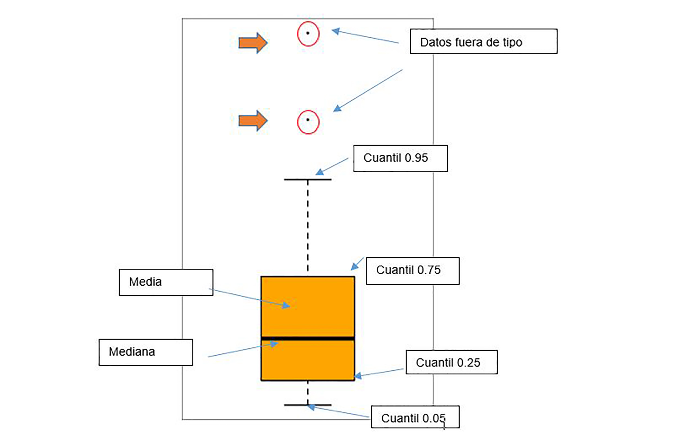
```

Los gráficos de barra se obtienen con la función `barplot()`. En este
caso el argumento debe ser una valor por cada categoría, una forma de
obtenerla es utilizando la función `table()`.

```{r, message=TRUE, warning=FALSE}
edad<-c(17,18,18,17,18,19,18,16,18,18, 19, 19)
table(edad)
barplot(table(edad))
```

Existen otras librerías gráficas que veremos en detallas más adelante.

# Manipulación de datos usando tidyverse

A continuación vamos a aprender algunas de las funciones más comunes de
la `library(dplyr)`:

`select()`: extraer columnas. `filter()`: extraer filas según
condiciones. `mutate()`: crear nuevas columnas usando la información de
otras columnas. `group_by()` y `summarize()`: cálcula estadísticas en
datos agrupados. `arrange()`: ordena resultados. `count()`: conteo de
datos.

Para seleccionar columnas de una tabla de datos o data frame, se puede
usar la función `select()`. Luego, para seleccionar filas de acuerdo a
cierto criterio (filtrar), se aplica la función `filter()`.

```{r, message=TRUE, warning=FALSE}
library(dplyr)
select(datos, fecha, provincia, total)
```

De forma abreviada se lo puede escribir así:

```{r, message=TRUE, warning=FALSE}
dplyr::select(datos, fecha, provincia, total)# los argumentos son, primero el objeto que contiene el data frame, y luego los títulos de las columnas a extraer
```

Si quisíeramos solo los valores de una provincia

```{r message=TRUE, warning=FALSE}
dplyr::filter(datos, provincia == "Chubut") # los argumentos son, primero el objeto que contiene el data frame, y luego la columna con el criterio de filtro
```

Una forma alternativa de escribir código en R es utilizar la gramática
de los pipes (%\>%) que es distinta a todo lo que hemos visto antes en
R.El objetivo de un pipe es ayudar a escribir código de una manera que
sea más fácil de leer y entender. El pipe viene del paquete magrittr,
pero los paquetes del Tidyverse cargan %\>% automáticamente.

Repitamos lo que hemos hecho arriba, pero esta vez usando pipes.

```{r message=TRUE, warning=FALSE}
datos %>% select(fecha, provincia, total)
```

Si quisíeramos solo los valores de una provincia

```{r message=TRUE, warning=FALSE}
datos%>%filter(provincia == "Chubut") 
```

# Conociendo un poco más de R

## Algunos tipos de objetos en R

**R** trabaja con objetos los cuales tienen nombre, contenido y
atributos.

El atributo especifica el tipo de dato representado por el objeto. Para
entender la utilidad de estos atributos, consideremos una variable que
puede tomar los valores 1, 2, o 3, tal variable podría ser un número
entero, o el código de una variable categórica.

Los resultados de un análisis estadístico sobre esta variable van a
depender de sus características en cada caso. Los atributos de un objeto
proporcionan la información necesaria. En general, la acción de una
función sobre un objeto depende de los atributos de este último.

Todo objeto tiene dos atributos intrínsecos: tipo y longitud. El tipo se
refiere a la clase de los elementos en el objeto; numérico, carácter,
complejo, y lógico `(FALSE [Falso] or TRUE [Verdadero]).`

La longitud es simplemente el número de elementos en el objeto.

Las funciones `mode( )` y `length( )`, reportan el tipo y longitud del
objeto.

Ejemplos de tipos de objetos en R:

+-----------+-----------+----------------------+-----------+
| ob je to  | tipo      | Descripción          | ¿S oporta |
|           |           |                      | varios    |
|           |           |                      | tipos de  |
|           |           |                      | datos?    |
+===========+===========+======================+===========+
| `v e      | nu        | una variable en el   | No        |
|   c to r` | mérico,   | significado          |           |
|           | al fa     | comúnmente asumido   |           |
|           | bético, c |                      |           |
|           | omplejo o |                      |           |
|           | lógico    |                      |           |
+-----------+-----------+----------------------+-----------+
| `f a      | factor n  | una variable         | No        |
|   c to r` | umérico o | categórica.          |           |
|           | a lf      |                      |           |
|           | abético   |                      |           |
+-----------+-----------+----------------------+-----------+
| a rr eg   | nu        | una tabla de         | No        |
| lo (      | mérico, a | dimensión k.         |           |
| `a        | lf        |                      |           |
|   rr ay`) | abético c |                      |           |
|           | omplejo o |                      |           |
|           | lógico    |                      |           |
+-----------+-----------+----------------------+-----------+
| ma tr iz  | nu        | un caso particular   | No        |
| (`ma      | mérico,   | de un arreglo donde  |           |
|   tr ix`) | al fa     | k = 2.               |           |
|           | bético, c |                      |           |
|           | omplejo o |                      |           |
|           | lógico    |                      |           |
+-----------+-----------+----------------------+-----------+
| `d        | nu        | un (marco o base de  | Si        |
|   at a. f | mérico,   | datos) es una tabla  |           |
|   r am e` | al fa     | compuesta de uno o   |           |
|           | bético, c | más vectores y/o     |           |
|           | omplejo o | factores de la misma |           |
|           | lógico    | longitud pero que    |           |
|           |           | pueden ser de        |           |
|           |           | diferentes tipos     |           |
+-----------+-----------+----------------------+-----------+
| `t s`     | nu        | una serie temporal y | Si        |
|           | mérico,   | como tal contiene    |           |
|           | al fa     | atributos            |           |
|           | bético, c | adicionales tales    |           |
|           | omplejo o | como frecuencia y    |           |
|           | lógico    | fechas               |           |
+-----------+-----------+----------------------+-----------+
| l is ta   | nu        | puede contener       | Si        |
| (`l       | mérico, a | cualquier tipo de    |           |
|   i st )` | lf        | objeto incluyendo    |           |
|           | abético   | otras listas!        |           |
|           | co        |                      |           |
|           | mplejo,   |                      |           |
|           | lógico    |                      |           |
+-----------+-----------+----------------------+-----------+

**Vectores y matrices**

Si queremos, por ejemplo, que el objeto x contenga el vector (2, 1, 3.6,
5), debemos usar el comando c (que alude a x) para hacer la siguiente
asignación:

`x <- c(2,1,3.6,5)`

Una sucesión regular de números se puede obtener de la siguiente forma:

```{r}
x <- 1:10
x
```

Si queremos cambiar el incremento:

```{r}
x <- seq(1,10,2)
x
```

En el comando `seq` el primer argumento indica el punto inicial de la
sucesión, el segundo el punto final, y el tercero el incremento.

Es muy fácil generar con R sucesiones de números aleatorios. El programa
utiliza funciones de la forma `rdistribucion (n,lista de argumentos)`
para generar n observaciones de una larga lista de distribuciones.

Para R, una matriz no es más que un vector con un atributo adicional que
contiene el número de filas y columnas. Por lo tanto, una matriz se
puede crear a partir de un vector, añadiendo información sobre el número
de filas y columnas de la matriz. Por ejemplo, el siguiente comando
puede utilizarse para generar aleatoriamente 1000 datos con distribución
normal estándar que, a su vez, forman una matriz x con dimensión 10 ×
100:

`x <- matrix(rnorm(1000),nrow=10,ncol=100)`

Si creamos una matriz x, y queremos llamar a alguno de sus elementos,
podemos usar `x[i,j]`, donde (i, j) son la fila y la columna donde se
encuentra el elemento. Para extraer la tercera fila de la matriz y
guardarla en el vector y se escribe `y <- x[3,]`, es decir si no
especificamos el número de columna, R entiende que queremos todas las
columnas.

**Operaciones con matrices y vectores**

Existe un grupo de comandos en R para realizar operaciones algebraicas
con vectores y matrices, los más utilizados se describen en las
siguientes tablas:

*Comandos matriciales en R*

| Comando     | operación                                             |
|-------------|-------------------------------------------------------|
| `matrix`    | Crea una matriz a partir del conjunto de valores dado |
| `diag`      | Crea una matriz diagonal o extrae diagonales,         |
| `as.matrix` | intenta convertir su argumento en una matriz,         |
| `is.matrix` | prueba si su argumento es una matriz (estricta)       |
| `dimnames`  | recupera o establece los dimnames de un objeto,       |
| `colnames`  | recupera o establece los nombres de columna,          |
| `colIds`    | ... usar alternativamente,                            |
| `rownames`  | recupera o establece los nombres de fila,             |
| `rowIds`    | ... usar alternativamente.                            |

*Funciones estadísticas básicas:*

| comando | operación                        |
|---------|----------------------------------|
| var     | Devuelve la matriz de varianza,  |
| cov     | Devuelve la matriz de covarianza |

*Ficheros de datos (Data Frame)*

Literalmente el término `“dataframe”` se podría traducirse como "hoja de
datos". La estructura de un data.frame()es similar a una hoja de datos
de excel, en los que cada fila corresponde a un sujeto y cada columna a
una variable. También es semejante a una matriz, solo que una matriz
admite únicamente valores numéricos, mientras que en un `data.frame()`
podemos incluir también datos alfanuméricos.

Creación de un `data.frame()`

Vimos anteriormente como crear un `data frame()` con datos externos,
pero podemos crear un data frame ingresando datos, o como veremos más
adelante importando datos de archivos externos. El siguiente ejemplo
muestra cómo crear un `data.frame` a partir de los datos recogidos sobre
una muestra de 10 alumnos de escuela primaria, para cada una de las
cuales se ha registrado su edad, altura y sexo.

```{r}
edad <- c(12, 11, 9, 8, 10, 12, 10, 9, 12, 10)
altura <- c(1.42, 103.6, 118.9, 138.1, 120.3, 109.9, 124.8, 133.7, 122.9, 119.2)
sexo <- c("M","H","H","M","M","H","M","M","H","H")
datos <- data.frame(edad,altura,sexo)
datos
```

## Funciones matemáticas

En R se encuentran definidas todas las funciones matemáticas. En la
siguiente tabla podemos ver algunos ejemplos.

+----------------+--------------------------------------------------+
| Comando        | operación                                        |
+================+==================================================+
| `log(x)`       | logaritmo de base natural (e) de x               |
+----------------+--------------------------------------------------+
| `exp(x)`       | antilogaritmo de x de base e                     |
+----------------+--------------------------------------------------+
| `log(x,n)`     | logaritmo de base n de x                         |
+----------------+--------------------------------------------------+
| `log10(x)`     | logaritmo de base 10 de x                        |
+----------------+--------------------------------------------------+
| `sqrt(x)`      | raíz cuadrada de x                               |
+----------------+--------------------------------------------------+
| `factorial(x)` | igual a x!                                       |
+----------------+--------------------------------------------------+
| `round         | redondea el valor de x a un entero               |
| (x, digits=0)` |                                                  |
+----------------+--------------------------------------------------+
| `signif        | igual a x con 6 dígitos en notaciones científica |
| (x, digits=6)` |                                                  |
+----------------+--------------------------------------------------+
| `runif(n)`     | genera n números aleatorios entre 0 y 1 para una |
|                | distribución uniforme                            |
+----------------+--------------------------------------------------+
| `cos(x)`       | coseno de x                                      |
+----------------+--------------------------------------------------+
| `sin(x)`       | seno de x                                        |
+----------------+--------------------------------------------------+
| `abs(x)`       | valor absoluto de x                              |
+----------------+--------------------------------------------------+

Algo importante a tener en cuenta en R es que los datos faltantes se
expresan como `NA` por defecto (puede modificarse de ser necesario). Las
funciones matemáticas o estadísticas aplicadas sobre conjuntos de datos
que tienen algún dato faltante, dan como resultado `NA`. Por ejemplo, si
en el vector de registros de edades uno de los datos es faltante,
entonces el resultado será `NA`, sin embargo, muchas funciones tienen un
argumento `na.rm=TRUE` para removerlos:

```{r}
edad <- c(12, 11, 9, 8, 10, 12, 10, 9, 12, NA)
mean(edad)
mean(edad, na.rm = TRUE)
```

## Exportación de datos

Así como podemos importar datos desde hojas de cálculo, también podemos
exportar datos en formatos que puedan ser levantados desde Excel. Ya
sean las mismas, los resultados de un análisis, o se requiera para
visualizar y editar matrices o `data.frame`. La función que podemos
utilizar es `write.table()`. Por ejemplo, si quisiéramos exportar el
archivo: datos, los comandos serian:
`write.table(datos, file = "datos.txt")` El primer argumento es el
nombre del objeto que queremos guardar, va sin comillas. Observe que el
archivo exportado será guardado en la carpeta de directorio de trabajo.
file: es el nombre del archivo que queremos crear, en este caso si va
con comillas. La extensión debe ser incluida. Existen otra función
similar, `write.txt()` , esta guardada los archivos como archivos de
texto (\*.txt).Para más detalles se puede pedir ayuda tipeando:
`? write.csv` `? write.txt`

## Otras herramientas gráficas

Vimos una introducción a los gráficos básicos en R, que sirven
esencialmente para examinar de manera visual y rápida conjuntos de
datos. Existen, sin embargo, muchos tipos más y hay libros enteros
dedicados a ellos. Aunque nos restringiremos a los más comunes. En
internet se pueden encontrar más ejemplos otros, además de información
sobre cómo modificar sus parámetros por defecto: ejes, orientación de
etiquetas, etc. En la siguiente página se muestra una amplia galerías de
gráficos, muchos de ellos comparten los códigos de manera tal que
podemos adaptarlos a nuestros datos

```{r webgraf, echo=F, fig.cap= "Galeria Gráficos en R"}
#knitr::include_url('https://www.r-graph-gallery.com/', height = '600px')
```

Veamos algunas de las funciones gráficas más comunes, la idea es conocer
la potencia de las herramienta, difícilmente recordemos estos comandos,
pero si es interesante saber dónde encontrarlos.

En la siguiente tabla se describen los gráficos más comunes y sencillos
para utilizar alguno de ellos hay que instalar la librería
`library(lattice)`.

+--------------+---------------------------------------------------+
| C o m a n d  | operación                                         |
| o            |                                                   |
+==============+===================================================+
| \` a d d     | si es TRUE superpone el gráfico en el ya          |
|              | existente (si existe)                             |
| = F A L S E  |                                                   |
| \`           |                                                   |
+--------------+---------------------------------------------------+
| \` a x e     | si es FALSE no dibuja los ejes ni la caja del     |
|              | gráfico                                           |
| # s          |                                                   |
|              |                                                   |
| T R U E \`   |                                                   |
+--------------+---------------------------------------------------+
| \` t y       | Especifica el tipo de gráfico; "p": puntos, "l":  |
|              | líneas, "b": puntos conectados por líneas, .o":   |
| p e = " p "  | igual al anterior, pero las líneas están sobre    |
| \`           | los puntos, "h": líneas verticales, "s":          |
|              | escaleras, los datos se representan como la parte |
|              | superior de las líneas verticales, "S": igual al  |
|              | anterior pero los datos se representan como la    |
|              | parte inferior de las líneas verticales.          |
+--------------+---------------------------------------------------+
| \` x l i m = | especifica los límites inferiores y superiores de |
| ,            | los ejes; por ejemplo con `xlim=c(1, 10)` o       |
|              | `xlim=range(x)`,`xlab=`, `ylab=` títulos en los   |
| y l i m = \` | ejes; deben ser variables de tipo carácter        |
+--------------+---------------------------------------------------+
| `            | título principal; debe ser de tipo carácter       |
| m  a  i n =` |                                                   |
+--------------+---------------------------------------------------+
| `s  u b =`   | sub-título (escrito en una letra más pequeña)     |
+--------------+---------------------------------------------------+

Las opciones y argumentos para cada una de estas opciones se pueden
encontrar en la ayuda incorporada en R. Algunas de estas opciones son
idénticas para varias funciones gráficas; éstas son las principales (con
sus valores por defecto):

+--------------+---------------------------------------------------+
| C o m a n d  | operación                                         |
| o            |                                                   |
+==============+===================================================+
| `a d d =     | si es TRUE superpone el gráfico en el ya          |
| F  A  L S E` | existente (si existe)                             |
+--------------+---------------------------------------------------+
| `a x e s     | si es FALSE no dibuja los ejes ni la caja del     |
| =  T  R U E` | gráfico                                           |
+--------------+---------------------------------------------------+
| `t y p       | Especifica el tipo de gráfico; "p": puntos, "l":  |
| e  =  " p "` | líneas, "b": puntos conectados por líneas, .o":   |
|              | igual al anterior, pero las l´ıneas están sobre   |
|              | los puntos, "h": líneas verticales, "s":          |
|              | escaleras, los datos se representan como la parte |
|              | superior de las líneas verticales, "S": igual al  |
|              | anterior pero los datos se representan como la    |
|              | parte inferior de las líneas verticales.          |
+--------------+---------------------------------------------------+

R posee un conjunto de funciones gráficas que afectan una gráfica ya
existente, estos son los principales:

+---------------+-------------------------------------------------+
| Comando       | operación                                       |
+===============+=================================================+
| `p oint       | agrega puntos (se puede usar la opción type=)   |
|   s (x,   y)` |                                                 |
+---------------+-------------------------------------------------+
| `line         | igual a la anterior pero con líneas             |
|   s (x,   y)` |                                                 |
+---------------+-------------------------------------------------+
| `text(        | agrega texto dado por labels en las coordenadas |
|   x,  y,  lab | (x,y); un uso típico: plot(x, y,type="n");      |
|   e ls, ...)` |                                                 |
+---------------+-------------------------------------------------+
| `t ext        | agrega texto dado por text en el margen         |
|   (x, y,   na | especificado por side (ver axis() más abajo);   |
|   mes)   mtex | line especifica la línea del área de graficado  |
|    t( text, s | segments (x0,y0, x1, y1)dibuja una línea desde  |
|   id e=3 , li | el punto (x0,y0) hasta el punto (x1,y1)         |
|   n e=0,...)` |                                                 |
+---------------+-------------------------------------------------+
| `ar  row      | igual al anterior pero con flechas desde        |
|  s (x0,    y0 | (x0,y0) si code=2, al punto (x1,y1) si code=1,  |
|  ,   x 1, y1, | o en ambos si code=3; angle controla el ángulo  |
|   an gle = 30 | desde la base de la flecha hasta la punta de la |
|   ,  code=2)` | misma                                           |
+---------------+-------------------------------------------------+
| `ab           | dibuja una línea con pendiente b e intercepto a |
|   l ine(a,b)` |                                                 |
+---------------+-------------------------------------------------+
| `ab           | dibuja una línea horizontal en la ordenada y    |
|   l ine(h=y)` |                                                 |
+---------------+-------------------------------------------------+
| `ab           | dibuja una línea vertical en la abcisa x        |
|   l ine(v=x)` |                                                 |
+---------------+-------------------------------------------------+
| `a blin       | dibuja la línea de regresión dada por lm.obj    |
|   e (lm.obj)` |                                                 |
+---------------+-------------------------------------------------+
| `rec          | dibuja un rectángulo donde las esquinas         |
|   t( x1,   y1 | izquierda, derecha, superior e inferior están   |
|   ,  x2, y2)` | dadas por x1, x2, y1, y y2, respectivamente     |
+---------------+-------------------------------------------------+
| `po lygo      | dibuja un polígono uniendo los puntos dados por |
|   n (x,   y)` | x y y                                           |
+---------------+-------------------------------------------------+
| `lege         | agrega la leyenda en el punto (x,y) con         |
|   nd (x,    y | símbolos dados por legend                       |
|   ,  legend)` |                                                 |
+---------------+-------------------------------------------------+
| `title()`     | agrega un título y opcionalmente un sub-titulo  |
+---------------+-------------------------------------------------+
| `ax is( side  | agrega un eje en la parte inferior (side=1),    |
|   ,    vect)` | izquierda (2), superior (3), o derecha (4);     |
|               | vect (opcional) da la abscisa (u ordenada)      |
|               | donde se deben dibujar los marcadores('tick     |
|               | marks') del eje                                 |
+---------------+-------------------------------------------------+
| `rug(x)`      | dibuja los datos x en el eje x como pequeñas    |
|               | líneas verticales                               |
+---------------+-------------------------------------------------+
| `lo cator(    | con el ratón; también dibuja símbolos           |
|   n,   t ype= | (type="p") o líneas (type="l") con respecto a   |
|   " n", ...)` | parámetros gráficos opcionales (...); por       |
|               | defecto no se dibuja nada (type="n")            |
+---------------+-------------------------------------------------+
| `id enti      | Similar a locator() con la diferencia que       |
|   f y(x,...)` | imprime en la gráfica el valor de x (u          |
|               | opcionalmente de una leyenda especificada en la |
|               | opción labels=) más cercano al punto donde se   |
|               | hizo click. Útil para identificar puntos en la  |
|               | gráfica que están asociados con nombres.        |
+---------------+-------------------------------------------------+

# Bibliografía y enlaces de interés

## Sobre **R** y **RStudio**

[Introducción a estadística con R, Matias
Andino](https://bookdown.org/matiasandina/R-intro/)

["R para profesionales de los datos: una introducción, Carlos J. Gil
Bellosta"](https://www.datanalytics.com/libro_r/index.html)

[Introducción a **R** Notas sobre **R**: Un entorno de programación para
Análisis de Datos y Gráficos Versión 1.0.1
(2000-05-16)](https://cran.r-project.org/doc/contrib/R-intro-1.1.0-espanol.1.pdf)

[**R** para Principiantes. Emmanuel
Paradis](https://cran.r-project.org/doc/contrib/rdebuts_es.pdf)

[Tutorial
**RStudio**](http://mcolebrook.github.io/CursoRStudio/RStudio.html#(1))

[Cursos masivos y otra formación on-line sobre
R.](http://r-es.org/2016/02/12/cursos-masivos-y-otra-formacion-on-line-sobre-r/)

[Ficha de referencia de comandos by Jonathan
Baron](https://cran.r-project.org/doc/contrib/refcard.pdf)
